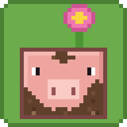

# Muddy Pig

The Muddy Pig from Minecraft Earth is back! It's a pig that loves mud and has a
flower growing on its head.

When its mud dries up, the flower closes and the pig goes looking for mud. When
it finds some, it jumps in and rolls around until it's all muddy again, and the
flower opens back up.

Lead a normal pig into mud and it rolls around and turns into a Muddy Pig too.
You can also find them in plains, but they're rare.

Fabric, for Minecraft 1.21.11 and 26.2. Needs Fabric API. Put it on the server
and in your game.

Made by Elduin, with Claude.
